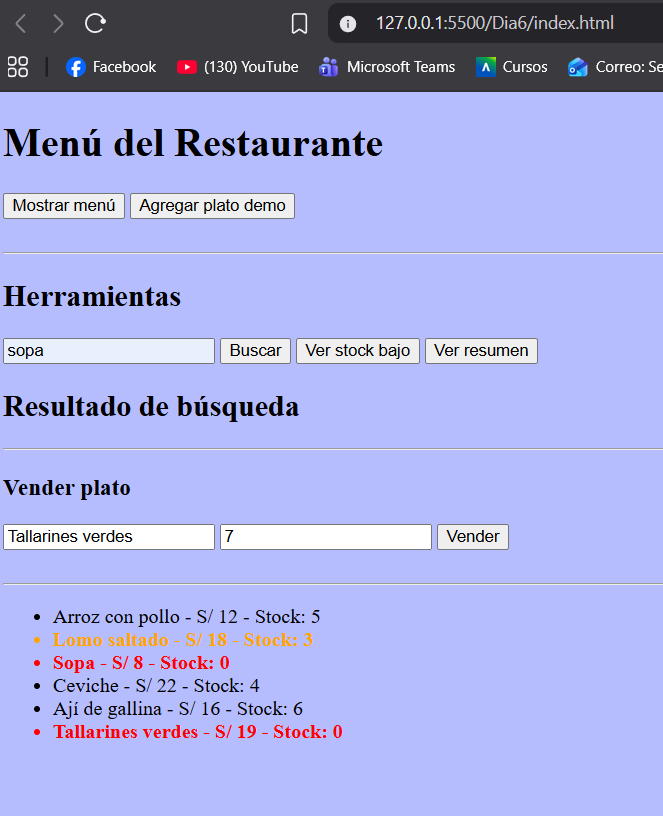

## EXPLICACION DE LA ESTRUCTURA  -  NICK CA

-nivel_4_arrays/    -    Contiene los ejercicios del día 3 (arrays).

-Dia4/              -    Contiene los ejercicios del día 4 (métodos y funciones nuevas).

-Dia5/              -    Contiene los ejercicios del día 5 (condicionales, bucles y estados).

-Dia6/              -    Contiene los ejercicios del dia 6 (Modularizacion)

---
## Estructura del proyecto - Dia6
menu.js
Contiene los datos del menú y funciones para acceder o modificar el menú.

operaciones.js
Contiene la lógica de negocio del restaurante:
buscar platos, vender, filtrar y verificar estados.

ui.js
Contiene la interfaz del usuario.
Renderiza el menú en pantalla y conecta los botones.

main.js
Es el punto de inicio del sistema.
Inicializa el programa y conecta todos los módulos.

---

# DIA 3 - ARRAYS

---

## DIA 4 - METODOS

---

## DIA 5 - CONDICIONALES, BUCLES Y ESTADOS

 
---
## DIA 6 - MODULARIZACION

---
